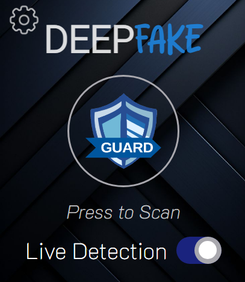
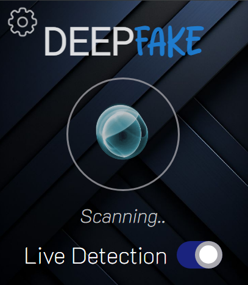
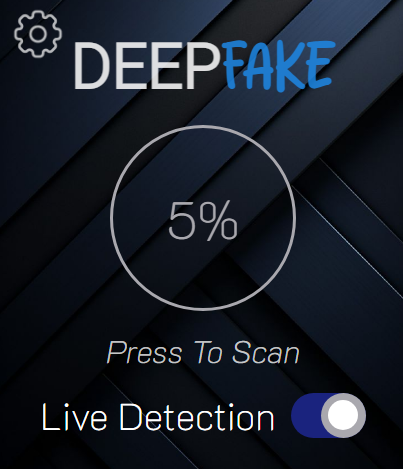
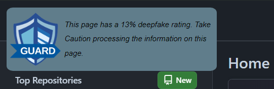
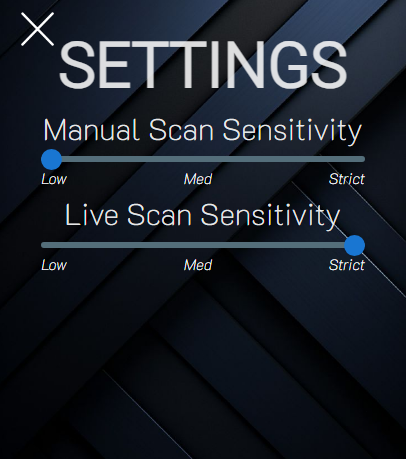

# Guard

This is a UI Demo of a deepfake detection browser extension. This was made for a unit at university.

Home page of guard

Guard running a scan

Guard displaying likelihood contents of page is deepfaked

Live detection enables a pop up that gives deepfake rating on the page.

Settings to tweak sensitivity of detection models

